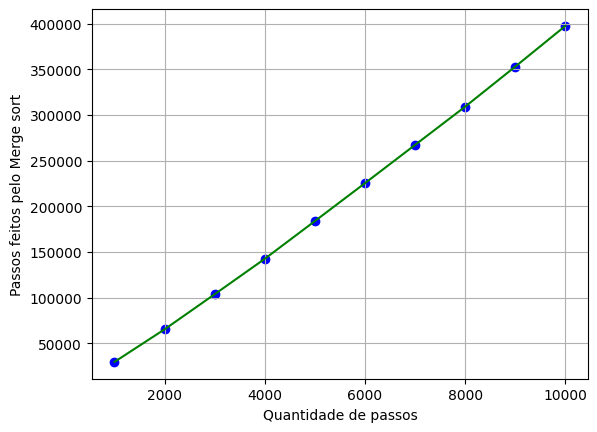

# Análise: Existe diferença entre os algoritmos de ordenação?

Os algoritmos de ordenação são rotinas computacionais que permitem que um conjunto de dados seja organizado em uma ordem específica. Eles são amplamente utilizados em várias aplicações, como classificação de resultados de pesquisa na web, processamento de grandes conjuntos de dados, organização de informações em bancos de dados e muito mais.

Para escolher o algoritmo de ordenação adequado, é importante considerar o tamanho dos dados e a complexidade da lista que se deseja ordenar, bem como a eficiência necessária para completar a tarefa. Algoritmos mais simples, como o Bubble Sort e o Selection Sort, são mais eficientes para conjuntos de dados menores, enquanto algoritmos mais complexos, como o Merge Sort e o Quick Sort, são mais adequados para conjuntos de dados maiores.

## Introdução

Imagine o quão dificultoso seria viver em um mundo caótico onde não existe ordem alfabética, ordem númerica, ordem de grandezas e nenhuma outra ordem lógica, automaticamente qualquer ação se torna trabalhosa e exaustiva, é como se, para fazer qualquer coisa, tivéssemos que procurar uma agulha no palheiro, imagine o quão difícil seria procurar um nome em uma agenda telefônica, uma palavra em um dicionário, ou o seu salgadinho favorito entre milhares de produtos em um enorme supermercado.

É ai que entra a ordenação, viver em um mundo ordenado é muito mais bonito, fácil e organizado, todas as tarefas automaticamente se tornam mais leves e menos custosas pois seria mais fácil encontrar qualquer coisa e chegar em qualquer lugar.

O nosso computador pensa da mesma forma, a ordenação é um dos processos mais importantes na computação, pois permite que os dados sejam manipulados e acessados de maneira mais eficiente. Além de facilitar a busca de informações em dicionários e outros tipos de listas, a ordenação é fundamental em diversas áreas da computação. Por exemplo, em bancos de dados e arquivos, a organização dos dados em uma ordem específica pode facilitar a busca por informações. Ao realizar uma consulta em um banco de dados, o sistema pode utilizar o algoritmo de busca binária para encontrar rapidamente os registros que atendem aos critérios da consulta, aproveitando a organização dos dados em uma ordem determinada. Além disso, a ordenação também pode ser utilizada para reduzir o tempo de acesso aos dados em sistemas de armazenamento, como discos rígidos e SSDs. Ao organizar os dados em uma ordem específica, é possível reduzir o tempo de busca e leitura dos dados, tornando o acesso aos mesmos mais rápido e eficiente.

Existem diversos algoritmos de ordenação, cada um com suas próprias caracteristicas, complexidade e eficiência, além da finalidade de cada um. Nesse artigo iremos discutir sobre os seis algoritmos mais famosos, Bubble sort, Selection sort, Insertion sort, Shell sort, Merge sort e o Quick sort.

## Descrição: Uma apresentação dos algoritmos e da notação Big(O).

**Caso já tenha conhecimento em big(O) e nos seis algoritmos que serão apresentados a seguir, sinta-se a vontade para pular essa parte**

Antes de começar a falar sobre os algoritmos de ordenação existe um termo no qual é preciso ter conhecimento para falar sobre a complexidade dos algoritmos e sobre o tempo de execução de cada um.

### Big(O)

A notação big(O) (ou grande O) é uma notação usada na ciência da computação para descrever o desempenho assintótico (para todos os valores suficientemente grandes) de um algoritmo. É uma forma de medir o tempo que um algoritmo leva para ser executado em relação ao tamanho da entrada do problema.

**O que isso significa?** A notação Big(O) representa a complexidade do pior caso de um algoritmo. O tempo máximo que ele pode levar para resolver um problema. Essa notação descreve como o tempo vai aumentar se o tamanho do problema também aumentar. Naturalmente, saber disso é útil pois podemos comparar algoritmos com diferentes complexidades e escolher o mais adequado para uma tarefa em específico e garantir que o tempo de execução seja otimizado. Veja mais sobre [Big(O)](https://pt.khanacademy.org/computing/computer-science/algorithms/asymptotic-notation/a/big-o-notation) na Khan Academy.

### Os algoritmos:

Os códigos referentes aos algoritmos apresentados a seguir podem ser encontrados facilmente em meu [repositório pessoal](https://github.com/Jhonatas-Anthony/DataStructure), onde estão disponíveis na linguagem C++.

1. **Bubble sort:**
   Esse é um algoritmo de ordenação dos mais simples de se implementar. Ele possui a ideia de percorrer uma lista diversas vezes e à cada vez faz o maior valor da sequência ir para o final da lista.

   Imagine que uma bolha vai passando em uma lista verificando sempre um número com seu sucessor, se o número for maior que seu sucessor, o algoritmo faz uma troca, dessa forma ele sempre vai garantir que o maior valor vai estar no final da lista.

   O bubble sort tem complexidade O(n²) visto que possui um loop dentro do outro, o primeiro loop vai passar por toda a lista repetidamente enquanto o segundo vai fazer as devidas ordenações. Todos os algoritmos com essa complexidade que serão apresentado aqui tem essa mesma caracteristica.

   Dessa maneira, um algoritmo com essa complexidade cresce em tempo quadrático, o que significa que seu desempenho piora rapidamente à medida que o tamanho da lista aumenta.

2. **Selection sort:**
   O Selection sort tem funcionamento parecido com o apresentado anteriormente, porém, apesar da complexidade ser a mesma, O(n²), esse algoritmo procura sempre colocar o menor valor no inicio da lista.

   O algoritmo percorre a lista várias vezes, comparando os elementos entre si e selecionando o menor elemento em cada passagem. Na primeira passagem, ele encontra o menor elemento e o coloca na primeira posição. Na segunda passagem, ele encontra o próximo menor elemento e o coloca na segunda posição, e assim por diante até que todo conteúdo esteja em ordem.

   Esse algoritmo também cresce em tempo quadrático, também possui uma fácil implementação e pode ser útil para ordenar listas pequenas ou como um passo inicial em algoritmos mais complexos.

3. **Insertion sort:**
   Antes de falar mais sobre esse algoritmo, saiba que comparado com os anteriores, esse algoritmo é muito eficiente para listas quase ordenadas, melhorando drasticamente seu desempenho, no pior dos casos o Insertion sort também vai ter complexidade O(n²).

   O algoritmo Insertion sort percorre a lista da esquerda para a direita e, para cada elemento, compara-o com os elementos anteriores na lista ordenada. Se o elemento for menor do que o elemento comparado, ele é movido para a posição correta. Esse processo é repetido até que todos os elementos sejam inseridos na lista ordenada.

4. **Shell sort:**
   Nesse ponto começaremos a trabalhar com a ideia de "dividir para conquistar", o Shell sort é uma extenção do algoritmo apresentado anteriormente, o Insertion sort.

   Ele funciona dividindo a lista a ser ordenada em sub-listas menores e aplicando o Insertion sort a cada sub-lista. A ideia por trás do Shell sort é que, ao aplicar o Insertion sort nas sub-listas menores, podemos reduzir o número de deslocamentos necessários para ordenar a lista.

   O algoritmo Shell sort começa dividindo a lista em sub-listas menores com um intervalo de k elementos. Ele aplica o Insertion sort a cada sub-lista e, em seguida, reduz o intervalo pela metade e repete o processo até que o intervalo seja 1, momento em que ele aplica o Insertion sort padrão para terminar de ordenar a lista, lembra que o Insertion sort é muito bom para listas quase ordenadas? Então! Esse é o ponto forte desse algoritmo.

   Apesar do Shell sort ser uma extesnão do Insertion sort, ele acaba se saindo melhor para listas maiores. Sua complexidade é difícil de determinar devido à variação do intervalo. No entanto, sua complexidade de tempo geralmente é considerada como algo entre O(n) e O(n²).

5. **Merge sort:**
   Adianto que esse é o algoritmo mais complexo mostrado até o momento, o Merge sort também tem a filosofia do "dividir para conquistar", assim como o quick sort que será apreesntado a seguir.

   O Merge sort é um algoritmo de ordenação do tipo dividir para conquistar que divide uma lista em duas metades iguais, ordena cada metade recursivamente e, em seguida, combina as duas metades ordenadas em uma única lista ordenada.

   O algoritmo Merge sort é eficiente para listas grandes, pois sua complexidade de tempo é O(n log n), onde n é o número de elementos na lista. Ele também é um algoritmo estável, o que significa que preserva a ordem relativa dos elementos com valores iguais.

   Para compreender o Merge sort vamos dividir ele em três etapas principais:

   1. Dividir a lista que será ordenada em duas metades iguais, recursivamente, até que cada sublista tenha apenas um elemento.
   2. Ordenar cada metade recursivamente, usando novamente o Merge sort.
   3. Por fim, o algoritmo combina as duas metades ordenadas em uma única lista, fundindo as duas sublistas em ordem crescente e ordenando o algoritmo.

6. **Quick sort:**
   O quick sort, quando desconsideramos a escolha do pivô (irei explicar o motivo), pode ser considerado o algoritmo ideal para lidar com o processo de ordenação de listas grandes, pois usa a recursivide como sua maior aliada nesse processo.

   Esse algoritmo trabalha escolhendo um termo como "pivô" e dividindo a lista em duas partes: Elementos menores que o pivô e elementos maiores que o pivô. Em seguida, o algoritmo repete o processo recursivamente para as duas sub-listas até que a lista esteja totalmente ordenada.

   A escolha do pivô é o passo mais importante do quick sort, se não esse algoritmo irá caminhar para o pior caso e terá complexidade 0(n²) e não complexidade O(n log n) - Para entender como uma complexidade log n influencia, veja mais na Khan Academy sobre [logaritmos](https://pt.khanacademy.org/math/algebra2/x2ec2f6f830c9fb89:logs/x2ec2f6f830c9fb89:log-intro/a/intro-to-logarithms).

   O algoritmo quick sort também pode ser dividido em três etapas:

   1. O algoritmo escolhe um pivô entre os elementos da lista.
   2. O algoritmo divide a lista em duas sub-listas, uma contendo os elementos menores que o pivô e outra contendo os elementos maiores que o pivô.
   3. O algoritmo ordena recursivamente as duas sub-listas usando o mesmo processo, escolhendo um novo pivô em cada sub-lista e particionando a lista novamente até que cada sub-lista contenha apenas um ou nenhum elemento. Em seguida, ele combina as sub-listas para obter a lista ordenada.

## Metodologia:

### Comparação: Qual a diferença entre esses algoritmos?

A fim de comparar os algoritmos de ordenação, é importante definir uma medida comum para avaliar o desempenho de cada um. Para isso, são utilizadas métricas, inicialmente, o tempo de execução foi a métrica escolhida. Essas medidas permitem quantificar o tempo e os recursos necessários para ordenar um conjunto de dados, possibilitando uma avaliação objetiva da eficiência de cada algoritmo.

Mas, ao escolher o tempo como medida, alguns obstáculos apareceram. Na computação, tudo acontece em uma velocidade incrível, o que torna o uso do tempo como medida ineficiente. Além disso, seria necessário trabalhar com listas enormes com mais de 1 milhão de itens para perceber a diferença entre os testes, o que pode ser inviável. Outro problema é que diferentes computadores podem apresentar resultados diferentes por causa do poder computacional de cada máquina, o que vai contra o método científico pois impossibilitaria a replicação dos experimentos. Para solucionar essas questões, é necessário utilizar medidas mais precisas e confiáveis. Isso permite que os resultados sejam comparáveis e que os experimentos possam ser replicados em diferentes ambientes.

Ao avaliar o desempenho dos algoritmos de ordenação, o número de operações realizadas se tornou a métrica mais eficiente para calcular o tempo de execução de cada algoritmo. Embora não tenha utilizado uma métrica cronometrada, consegui uma medida numérica da quantidade de passos executados por cada algoritmo. Para garantir que todos os algoritmos fossem avaliados sob as mesmas condições, criei um script em C++ para gerar uma lista aleátória com 1000, outra com 2000, 3000... até 10000 elementos, que foram usadas como entrada para todos os algoritmos. Em seguida, criei uma variável global em cada código chamada 'contador', que foi incrementada em 1 no final de cada laço de repetição e no início de cada estrutura condicional, permitindo que fosse calculado o número de passos que cada algoritmo leva para ordenar uma lista, pois dessa forma, toda ação do algoritmo seria contabilizada.

Após fazer os testes com cada algoritmo, os dados coletados foram postos em uma tabela afim de catalogar cada um deles:

##### Tabela 1:
| Tamanho | Bubble sort (bu) | Selection sort (se) | Insertion sort (in) | Shell sort (sh) | Merge sort (me) | Quick sort (qu) |
| :-----: | :--------------: | :-----------------: | :-----------------: | :-------------: | :-------------: | :-------------: |
|  1000   |      757038      |       505912        |       257770        |      14995      |      29649      |      12779      |
|  2000   |     2991997      |       2012849       |       993533        |      38125      |      65320      |      27118      |
|  3000   |     6784307      |       4521053       |       2286546       |      59899      |     103759      |      43410      |
|  4000   |     11985723     |       8029469       |       3988699       |      88375      |     142572      |      62822      |
|  5000   |     18758893     |      12536882       |       6262611       |     113942      |     183891      |      82030      |
|  6000   |     27024631     |      18047060       |       9029421       |     138798      |     225429      |      97938      |
|  7000   |     36553991     |      24554874       |      12059152       |     173344      |     267339      |     123317      |
|  8000   |     48082987     |      32063518       |      16088885       |     208895      |     309244      |     142075      |
|  9000   |     60771988     |      40572369       |      20278692       |     226429      |     353114      |     157609      |
|  10000  |     75062071     |      50080670       |      25069570       |     273441      |     397689      |     174120      |

### Gráficos:

**Quando aparecer a notação 1e7 acima do gráfico, basta multiplicar o valor do eixo y por 10 milhões**

Para montar os gráficos, foi utilizado a ferramenta [Google Colab](https://colab.research.google.com/), onde podemos escrever em documentos de caderno usado pelo [Jupyter Notebook](https://ipython.org/notebook.html), no qual é um ambiente interativo integrado com python onde pode-se trabalhar com dados, e a biblioteca [matplotlib](https://matplotlib.org/stable/index.html) para gerar os gráficos.

Conforme observamos a curva de crescimento de cada algoritmo, percebemos claramente como os três primeiros algoritmos cuja complexidade é O(n²) apresentam um crescimento vertiginoso. Conforme o tamanho do problema aumenta, a curva de crescimento desses algoritmos se ascentua cada vez mais, demonstrando que seu desempenho é significativamente impactado pelo tamanho da entrada.

##### Gráfico 1: 

##### Gráfico 2: 

##### Gráfico 3: 

Nos próximos algoritmos, observamos a implementação da filosofia do "dividir para conquistar" cuja complexidade é O(n log n). Nesses casos, o gráfico apresenta uma curva mais suave em relação aos algoritmos de complexidade O(n²), com um crescimento constante à medida que o tamanho do problema aumenta. Isso sugere que esses algoritmos podem ser mais eficientes e escaláveis ​​do que seus equivalentes O(n²) em problemas maiores. Essa abordagem é especialmente importante em aplicações que lidam com grandes conjuntos de dados ou necessitam de alta performance, pois pode permitir um processamento mais rápido e eficiente.
##### Gráfico 4: 

Como vimos, a variação de intervalo do Shell sort torna sua complexidade dificil de definir ficando entre O(n) e O(n²), perceba que nesse caso, a complexidade do Shell sort acaba se parecendo com um O(n log n)
##### Gráfico 5: 

##### Gráfico 6: 

Além disso, a melhor maneira de entender a diferença no desempenho dos algoritmos é comparando-os diretamente entre si. Notavelmente, o Insertion sort se mostrou o algoritmo mais eficiente com complexidade O(n²), enquanto o Merge sort se mostrou o pior algoritmo com complexidade O(n log n). Esses dois algoritmos foram escolhidos para mostrar que apesar de um ser o "melhor" e outro o "pior" das suas devidas complexidades, ao comparar o gráfico desses dois algoritmos, conseguimos ver essa desproporção.

##### Gráfico 7: 
.png)

Note-se que, apresentar gráficos separados não traz o efeito da comparação. Por isso, todos os resultados foram juntados em um mesmo gráfico, permitindo comparar todos os gráficos e compará-los entre si.
##### Gráfico 8: 

## Conclusão: Quais foram os resultados obtidos?

Os primeiros algoritmos de ordenação, como o Bubble Sort e o Selection Sort, possuem uma implementação mais simples e são ótimos para fins educacionais e para lidar com pequenos conjuntos de dados. No entanto, à medida que o tamanho dos dados aumenta, a complexidade desses algoritmos se torna rapidamente um gargalo para o desempenho, tornando-os inadequados para aplicações em larga escala. Por outro lado, algoritmos mais complexos, como o Merge Sort e o Quick Sort, são mais eficientes em lidar com grandes quantidades de dados, o que os torna ideais para aplicativos que exigem alta performance.

Ao analisar os resultados obtidos, fica evidente a diferença de desempenho entre os algoritmos de ordenação. Para ilustrar essa disparidade, basta comparar o Bubble Sort com o Quick Sort na tarefa de ordenar uma lista com 10 mil valores. Enquanto o Bubble Sort executou aproximadamente 75 milhões de passos, o Quick Sort precisou de 175 mil passos, aproximadamente, implicando em uma redução percentual de cerca de 99,7%. Agora, imagine que o tempo, uma medida cronométrica, está sendo usado como métrica, caso o Bubble sort ordene essa lista em 1 segundo, o Quick sort vai fazer o mesmo trabalho em 0.003 segundos, reforçando ainda mais o motivo da métrica usada ser o número de operações.

Em um ambiente hipotético, onde o Bubble sort demoraria 1 segundo para resolver o problema com 10 mil elementos, conseguimos, atráves do cálculo da redução percentual, descobrir em quanto tempo cada algoritmo resolveria o mesmo problema: Veja as duas tabelas a seguir, a tabela 2 traz a redução percentual aproximada comparando todos os algoritmos com o Bubble sort. E a tabela 3 traz a relação entre essa redução percentual e o tempo, trazendo uma medida cronométrica levando esse ambiente hipotético em questão.  

##### Tabela 2: 
| Bubble sort | Selection sort | Insertion sort | Shell sort | Merge sort | Quick sort |
| :---------: | :------------: | :------------: | :--------: | :--------: | :--------: |
| 100% | 33.2% | 66.6% | 99.6% | 99.4% | 99.7% |

##### Tabela 3: 
| Bubble sort | Selection sort | Insertion sort | Shell sort | Merge sort | Quick sort |
| :---------: | :------------: | :------------: | :--------: | :--------: | :--------: |
| 1 segundo | 668 milisegundos | 333 milisegundos | 4 milisegundos | 6 milisegundos | 3 milisegundos |

A tabela 1 e o gráfico 8 mostram como cada algoritmo se sai com os mesmos problemas, revelando como os algoritmos com complexidade O(n²) crescem rapidamente em número de operações ao passo que o problema aumenta, enquanto os três últimos começam a dividir o problema em outros menores para simplificar a resolução e o crescimento é bem menor.

Veja a comparação entre o número de passos de todos os algoritmos ordenando a lista com 1000 elementos:
##### Gráfico 9: 

Evidentemete a escolha do algoritmo adequado pode fazer uma grande diferença no desempenho da ordenação, especialmente quando se trata de grandes conjuntos de dados. Todos os algoritmos conseguem ter o mesmo resultado quando se trata de ordenação, mas quando falamos de desempenho a história muda.

Portanto, conclui-se que a escolha da métrica usada como sendo o número de passos que um algoritmo leva para ordenar uma lista, nos fornece indiretamente o tempo de cada algoritmo em um ambiente hipotético, pois, com o cálculo da redução percentual, conseguimos calcular em quanto tempo cada algoritmo conseguiria resolver um problema levando em conta o resultado de outro algoritmo, pois com essa relação conseguimos fazer a seguinte comparação: Se o Insertion sort ordena um array com 10 mil itens em 1 segundo, o Merge sort levaria apenas 0,008 segundos para fazer o mesmo trabalho pois a redução percentual entre os dois é de aproximadamente 99.2%.

# Referências: 
